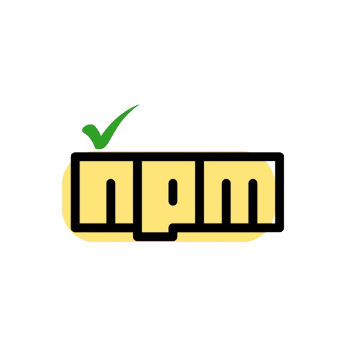

<div align="center">
  

  <h1>npm-name-checker2</h1>

  <p>
	<a href="#features">features</a> •
	<a href="#Install">Installation</a> •
	<a href="#Usage">Usage</a>
  </p>


  <p>
    <a href="https://github.com/Silent-Watcher/npm-name-checker/blob/master/LICENSE">
      
    </a>
  </p>

  <p>⭐️ Please press the star! It greatly helps development! ⭐️</p>
  <p>A fast and efficient CLI tool to check the availability of package names on npm and repository names on GitHub..</p>


</div>


## Install

```bash
npm i -g npm-name-checker2
```

## Usage

Check a package name on npm:

```bash
name-check my-package-name
```
To check both npm and GitHub availability, provide the GitHub owner/organization:

```bash
name-check my-package-name -o my-github-username
```
**Examples**

```bash
# Check npm only
name-check awesome-package

# Check npm and GitHub
name-check awesome-package -o my-org

# Results will show:
# npm:     Available ✅
# github:  Taken     ❌
```
## Features

- Multi-platform checking: Verify name availability on both npm and GitHub
- Real-time results: Get immediate feedback with color-coded output
- Simple interface: Easy-to-use command line interface
- TypeScript: Built with modern TypeScript for reliability
- Smart caching: Results are cached locally to improve performance
- Rate limiting: Automatic retry logic for API rate limits


## Cache Management

View cached entries:

```bash
name-check cache list
```

Clear all cached data:

```bash
name-check cache clear
```


---

## Contributing

Contributions welcome! Please open issues for feature requests or bugs.

---

## License

MIT — see `LICENSE` for details.

---

<div align="center">
  <p>
    <sub>Built with ❤️ by <a href="https://github.com/Silent-Watcher" target="_blank">Ali Nazari</a>, for developers.</sub>
  </p>
  <p>
    <a href="https://github.com/Silent-Watcher/npm-name-checker">⭐ Star us on GitHub</a> •
    <a href="https://www.linkedin.com/in/alitte/">🐦 Follow on Linkedin</a>
  </p>
</div>
